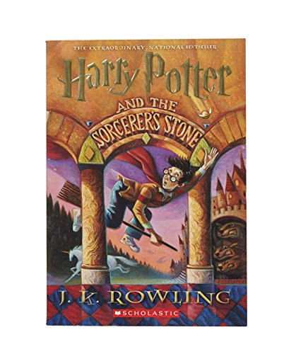

## Katherine Ayers
# Project 3 ReadMe
I think for this project I'm going to take something from Harry Potter.
I'll take this quote group for it from whichever book I'm choosing, here is that quote
*“I can teach you how to bottle fame, brew glory, even put a stopper on death.”
― J.K. Rowling, Harry Potter and the Sorcerer's Stone*
perhaps the scene from the first book where they go buy everything for Harry because it's quite whimsicaland rather colorful in the movie creating a colorful pallate
I'll insert a bio on Jk Rowling from biography.com. <a href "https://www.biography.com/people/jk-rowling-40998">Here. </a>
I think for simplicity I'll take a color pallate from the movie and maybe throw my own spin on it
I like the font able from <a href "https://www.fonts.com/search/all-fonts?ShowAllFonts=All&searchtext=harry%20potter">font.com </a>
and the font harry potter from <a href="http://www.fontspace.com/category/harry%20potter"> fontspace.com </a>
My color pallete came directly from this image-

The colors I plan on using so far are #f6a46d,and #ad1d04, I'll add more when I find that I need them.
# The Process
For this project, the HTML for it is becomming easier and that was really exciting. So I did all the HTML first for this project so that it was for sure done.
The problem I had the most was incorporating CSS in general. I tried many variations of calling the file in my index, but nothing was working. So I tried to at least style everything the best I could and hope I could get it to work. So not everything will be there probably. It's hard to style something you can't see.
I have managed to get the css file called in the HTML file, but I'm having the hardest time with text. The one used from google with the url is fine, but the downloaded font isn't working. I also can't get the css files called in the other pages.
I couldn't get it, at the moment it doesn't meet all the requirements, but I intend on making it better.
