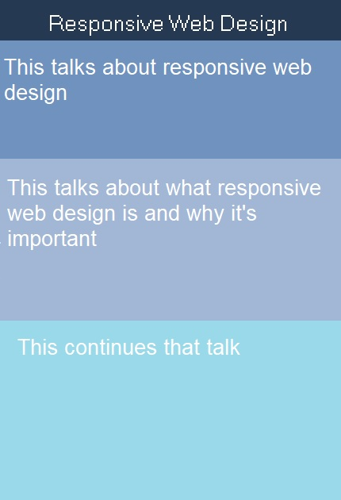
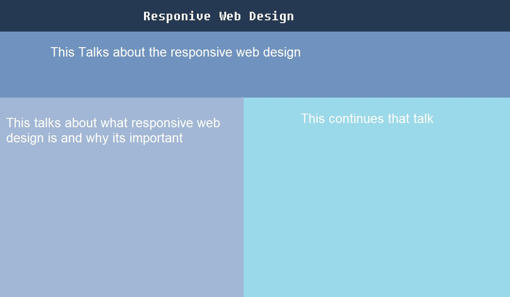

## Katherine Ayers
# Project 3 ReadMe
I started this project thinking out colors and otherwise with sketches. I didn't end up keeping these original sketches, I didn't feel like I needed to in the end, I ended up spending more time on the colors and trying to get the sizes correct. Here are the original sketches though

I started doing this project trying to do everything at one time, which was a mistake. I ended up redoing it completely and starting with just being able to apply the css stylesheet. I don't know why, but I have a hard time just doing that. After that it was a matter of deciding how to do the responsive web design. I ended up getting the stylesheet to apply and I used the @media way to do responsive web design, it seemed the easiest for me to test and apply percentages of the screen the boxes would fill. It worked fine, I tested it on several computers and my phone and it looked fine. Overall this project was a little difficult and frustrating but I got it and, while it doesn't look like my original sketch designs, it works as a project for responsive web design.
